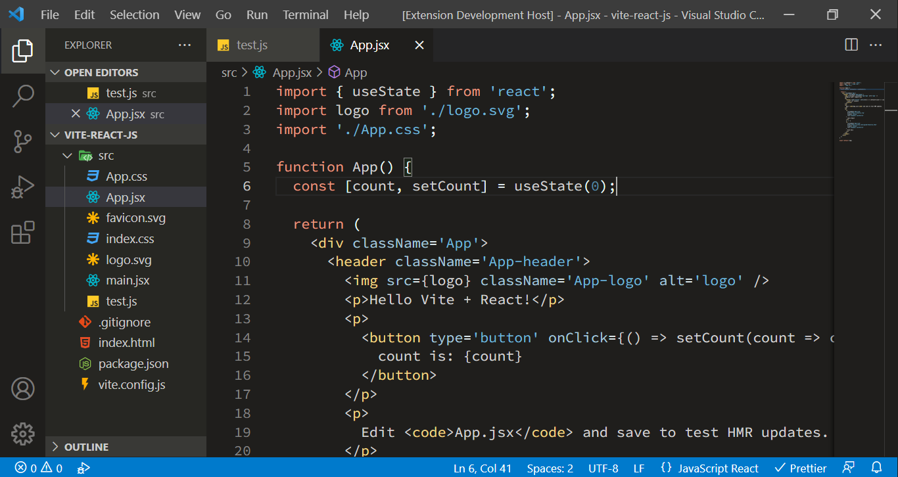

# Scrimba Dark Theme for VS code

## Scrimba Dark Theme

## Scrimba Dark Theme Editing

## Issues & Suggestions

For any issus and suggestions, please use [GitHub issues](https://github.com/drkcode/scrimba-dark-theme/issues)

## License

[MIT License](./LICENSE)

Thanks for checking my VS code theme.

**Enjoy!**
